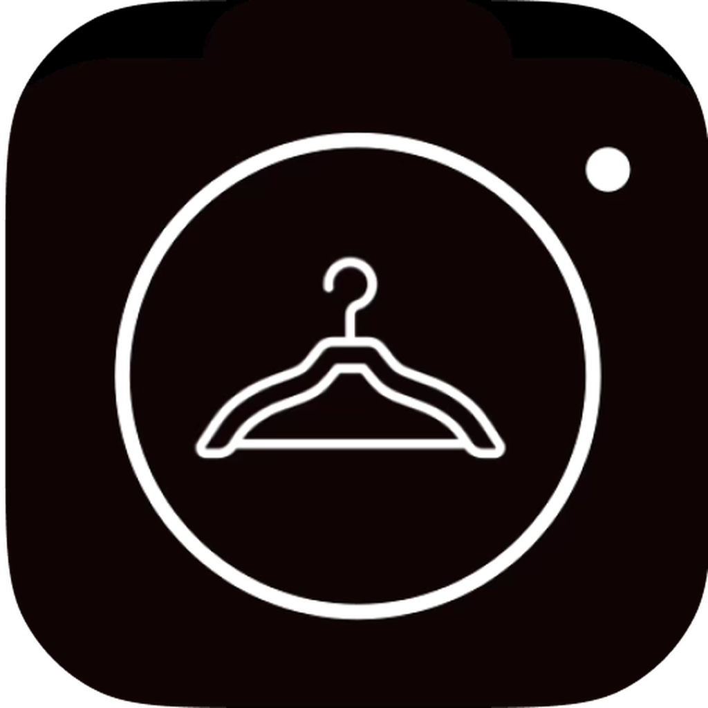
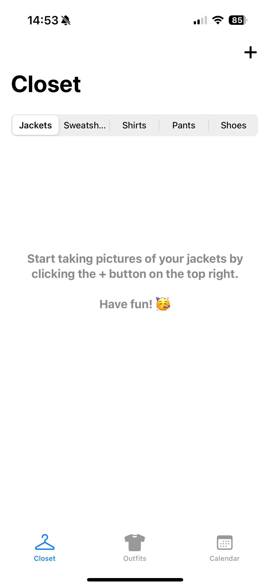
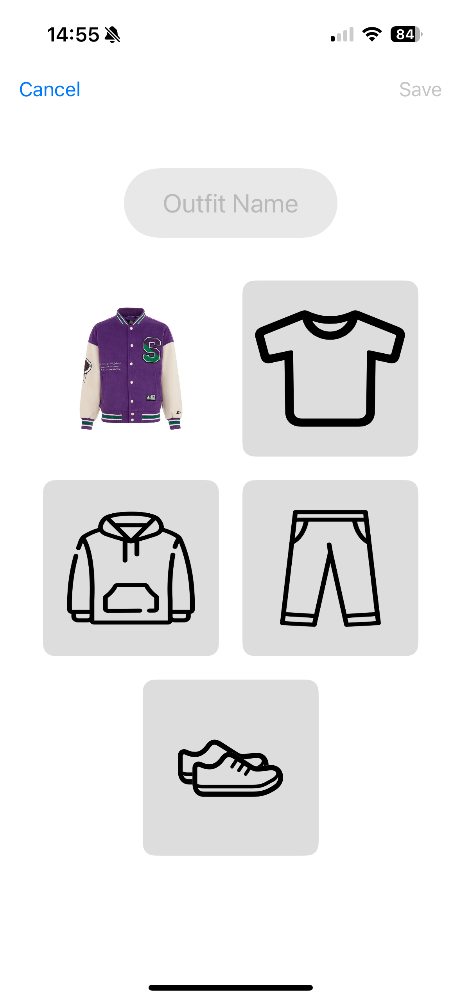
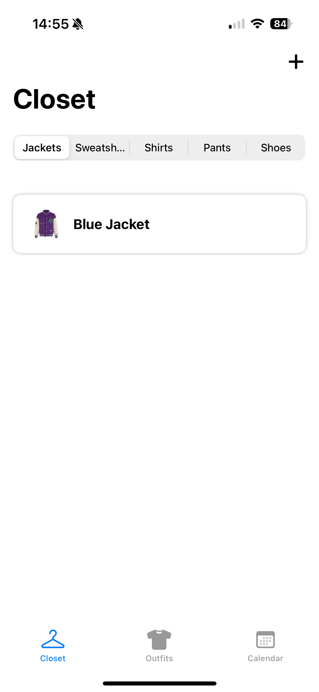
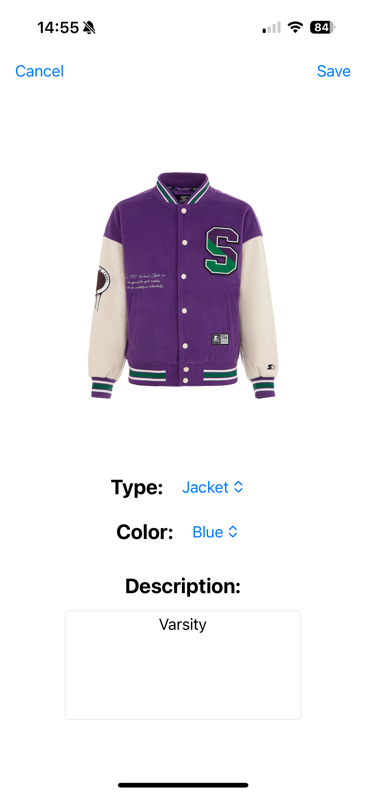
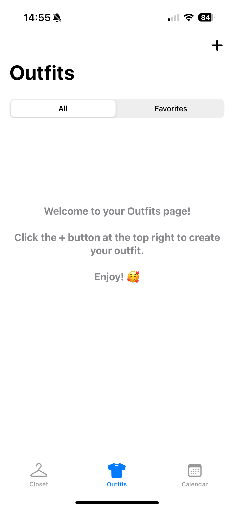
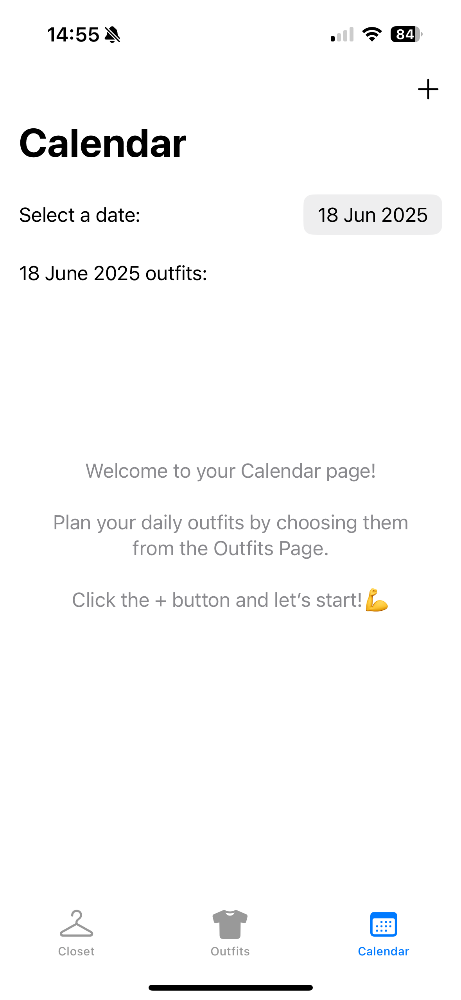

# Closetly

👗 Closetly: Your Personal Closet Organizer

Revolutionize your wardrobe management with Closetly, the app designed to keep your outfits organized and your mornings stress-free. 
Stop searching for what to wear and start enjoying your style effortlessly!

💡 Why Closetly?

Perfect for fashion lovers, busy professionals, or anyone looking to simplify their daily routine and express their style.

✨ Key Features

      

1. Upload Your Wardrobe: Easily snap and upload photos of your clothes—Closetly organizes everything for you!
2. Mix and Match Outfits: Experiment with endless combinations to find the perfect look for any occasion.
3. Plan Ahead with the Calendar: Schedule your outfits in advance to save time and ensure you’re always ready for the day.
4. Rediscover your wardrobe and take the stress out of getting dressed with Closetly. Your style, simplified!
